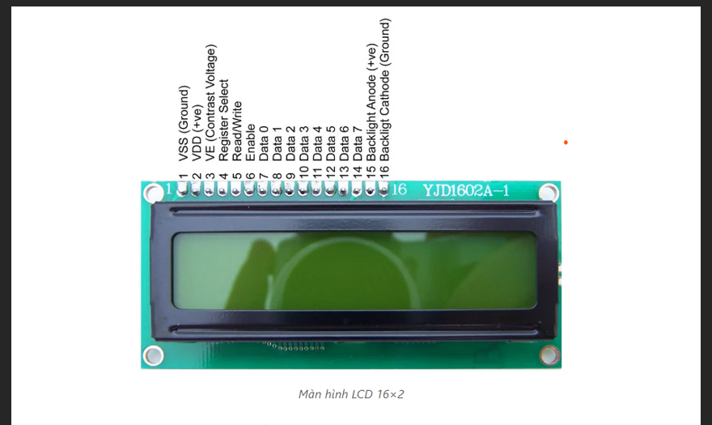

# Tran Duc Luong
Khóa cửa thông minh sử dụng RFID, Keypass

## I. Linh kiện sử dụng
1. Arduino Uno R3: một trong những bo mạch phổ biến nhất trên thị trường với việc tích hợp vi điều khiển ATmega328P và chip giao tiếp USB CH340. Với kiến trúc dễ dàng sử dụng và cấu hình, nó cho phép người dùng làm việc trực tiếp với các bộ cảm biến, module và các linh kiện điện tử khác để tạo nên các ứng dụng tùy chỉnh độc đáo của riêng mình.

2. Module RFID RC522: 
- RFID là viết tắt của “Radio Frequency Identification”, có nghĩa là nhận dạng bằng tần số radio. Đây là một công nghệ sử dụng sóng radio để truyền và nhận dạng thông tin từ một thẻ hoặc một thiết bị RFID. Hệ thống RFID bao gồm ít nhất hai thành phần chính: một thẻ RFID (hay còn gọi là tag RFID) và một đầu đọc RFID (hay còn gọi là reader RFID).
- Thẻ RFID thường được gắn vật lên vật thể, nó chứa một anten để thu phát sóng radio và một chip chứa thông tin cần được nhận dạng. Đầu đọc RFID sử dụng sóng radio để truyền đi và nhận lại thông tin từ thẻ RFID. Khi thẻ RFID được đặt trong phạm vi hoạt động của đầu đọc RFID, thông tin từ thẻ sẽ được truyền đến đầu đọc RFID để xử lý và xác định thông tin nhận dạng.
- Module RFID Arduino bao gồm một chip đọc RFID MFRC522 và các thành phần khác như anten và các linh kiện điện tử. Chip MFRC522 có khả năng đọc và ghi dữ liệu từ các thẻ RFID tiêu chuẩn, bao gồm các loại thẻ MIFARE và các loại thẻ tương thích.

3. Keyad 3*4

4. Màn hình LCD 16x2 & Module I2C

## II. Thiết kế hệ thống
1. Sơ đồ khối của hệ thống

2. Nguyên lí hoạt động
- Khối đầu vào: Khối tiếp nhận thông tin đầu vào là sự thay đổi tín hiệu của module RFID-RCC522 hoặc Keypad 3*4 
- Khối điều khiển: Sau khi có tín hiệu của khối đầu vào thì tín hiệu sẽ được đưa vào khối điều khiển để xử lý và điều khiển các khối về sau 
- Khối chấp hành: Khi khối điều khiển có tín hiệu được đưa đến thì khối chấp hành sẽ thực hiện, đồng thời cả khối hiển thị cũng sẽ hoạt động để hiển thị trạng thái. 
- Khối cảnh báo: khi khối điều khiển có tìn hiệu cũng sẽ hoạt động để hiển thị các cảnh báo.
3. Mô tả hoạt động của hệ thống
- Nếu dùng phương pháp quẹt thẻ,thẻ ta quẹt mà đúng thì cửa sẽ tự động mở và sẽ hiển thị trạng thái trên màn LCD,nếu nhập sai cửa sẽ không mở và đồng thời có cảnh báo hiển thị trên màn LCD, quá 3 lần sai thì còi sẽ báo động,sau đó ta sẽ phải chờ một thời gian thì mới có thể nhập lại.
- Nếu ta dùng phương pháp nhập mật mã ( Password):Nhập mật khẩu đúng cửa sẽ được mở và hiển thị trạng thái lên màn LCD,nếu nhập sai cửa sẽ không mở và đồng thời có cảnh báo hiển thị trên màn LCD, quá 3 lần sai thì còi sẽ báo động,sau đó ta sẽ phải chờ một thời gian thì mới có thể nhập lại.
